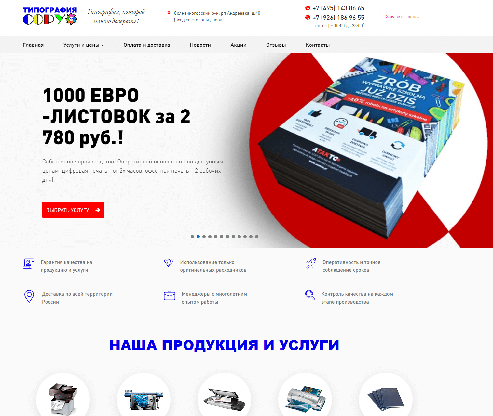
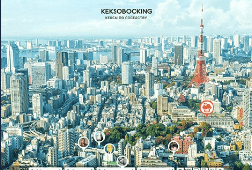

## Porftolio of Pavel Zotov

### Website for the doctor
<table border="0">
    <tr>
    <td width="400">
       <ul>
        <li><strong>Address: </strong> <a href="https://dr-rotov.ru" target="_blank">https://dr-rotov.ru</a></li>
        <li><strong>Technologies: </strong> WordPress, JS, HTML5, CSS3, PHP</li>
        <li><strong>Key features: </strong> 
            <ul>
                <li>mini-CRM to track the visitors</li>
                <li>interactive quizes to clarify the diagnosis</li>
                <li>different color schemes for more availability</li>
                <li>calendar widget for appoitments</li>
            </ul>
        </li>
       </ul>
    </td>
    <td>
        
    </td>
    </tr>
</table>

### Corporate website for POS trading company
<table border="0">
    <tr>
    <td width="400">
       <ul>
        <li><strong>Address: </strong> <a href="https://barnetpos.com" target="_blank">https://barnetpos.com</a></li>
        <li><strong>Technologies: </strong> WordPress, JS, HTML5, CSS3, PHP</li>
        <li><strong>Key features: </strong> 
            <ul>
                <li>support page for customers with search mechanism</li>
            </ul>
        </li>
       </ul>
    </td>
    <td>
        
    </td>
    </tr>
</table>

### Corporate website for typography
<table border="0">
    <tr>
    <td width="400">
       <ul>
        <li><strong>Address: </strong> <a href="https://copy77.ru" target="_blank">https://copy77.ru</a></li>
        <li><strong>Technologies: </strong> WordPress, JS, HTML5, CSS3, PHP</li>
        <li><strong>Key features: </strong> 
            <ul>
                <li>more than 10 interactive price calculators</li>
                <li>advanced file upload forms</li>
            </ul>
        </li>
       </ul>
    </td>
    <td>
        
    </td>
    </tr>
</table>

### Corporate website for autoschool
<table border="0">
    <tr>
    <td width="400">
       <ul>
        <li><strong>Address: </strong> <a href="https://arsdiesel33.ru" target="_blank">https://arsdiesel33.ru</a></li>
        <li><strong>Technologies: </strong> MODx, JS, HTML5, CSS3, PHP</li>
       </ul>
    </td>
    <td>
        
    </td>
    </tr>
</table>

### SPA for cinema fans
<table border="0">
    <tr>
    <td width="400">
       <ul>
        <li><strong>Repository: </strong> <a href="https://github.com/Zotoff/18416-what-to-watch-6" target="_blank">https://github.com/Zotoff/18416-what-to-watch-6</a></li>
        <li><strong>Skills: </strong> ES6, ReactJS, Redux, React Thunk</li>
       </ul>
    </td>
    <td>
        
    </td>
    </tr>
</table>

### SPA for travelers
<table border="0">
    <tr>
    <td width="400">
       <ul>
        <li><strong>Repository: </strong> <a href="https://github.com/Zotoff/18416-keksobooking-21" target="_blank">https://github.com/Zotoff/18416-keksobooking-21</a></li>
        <li><strong>Skills: </strong> JavaScript (ES6), Canvas</li>
       </ul>
    </td>
    <td>
        
    </td>
    </tr>
</table>